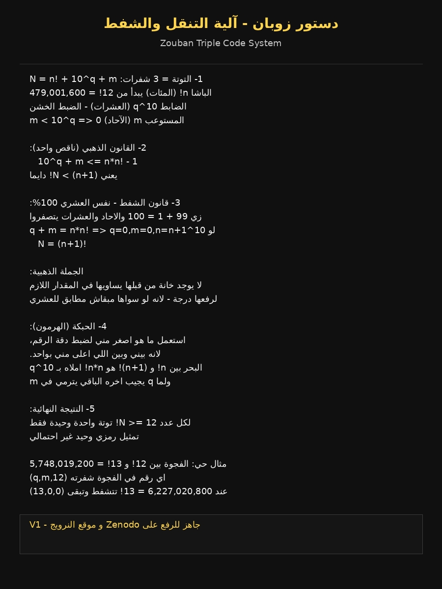

# 🛳️ نظام زوبان الثلاثي | Zouban Triple Code
### دستور زوبان - آلية التنقل والشفط
**N=n!+10^q+m**

**المكتشف: علي خلاف - مصر**
**التوثيق: 18 Sep 2026**

---
### 🖼️ الدليل المصور - دستور زوبان

### 📜 البروتوكولات الثلاثة موثقة في Issues
1. من اللامحدود الى 87.5 ديرزن
2. من 87.5 ديرزن الى الخرطوش  
3. المسلة المصرية - النرويجية

**الخرطوش = 87.5 صفحة = 875,000 سر**
